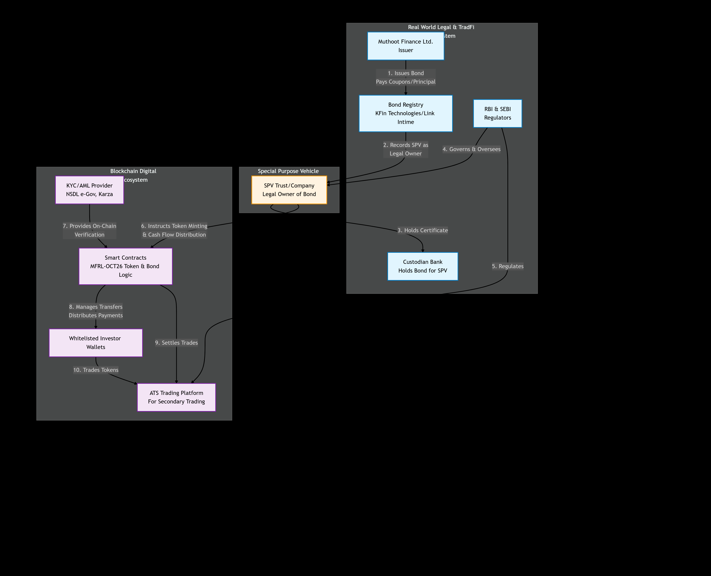

This repository contains the smart contracts for a tokenized bond system. The core innovation is combining a robust on-chain compliance mechanism (whitelisting) with a traditional legal structure (Special Purpose Vehicle) to create a digital representation of a real-world bond that enforces regulatory requirements like KYC/AML at the smart contract level.

